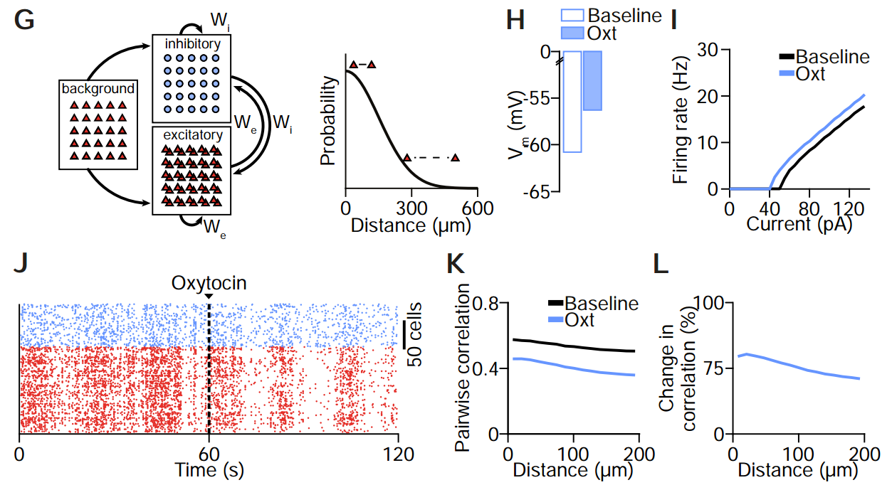

### Oxytocin-induced increase of the excitability of SST+ interneurons is sufficient to explain distance-dependent changes in correlation.



Jupyter notebook for running the model from Maldonado et al. *Current Biology* 2020 "Oxytocin shapes spontaneous activity patterns in the developing visual cortex by activating somatostatin interneurons"

---
### How to use

To install NEST with Conda, follow steps in the this tutorial : 

https://nest-simulator.readthedocs.io/en/v2.18.0/installation/conda_install.html

and set the flag 
```
  nest-simulator=*=mpi_openmpi*
```

to enable openmpi support. 

---

Code written by: Jan H Kirchner

email: jan.kirchner [at] brain.mpg.de

September 2020
